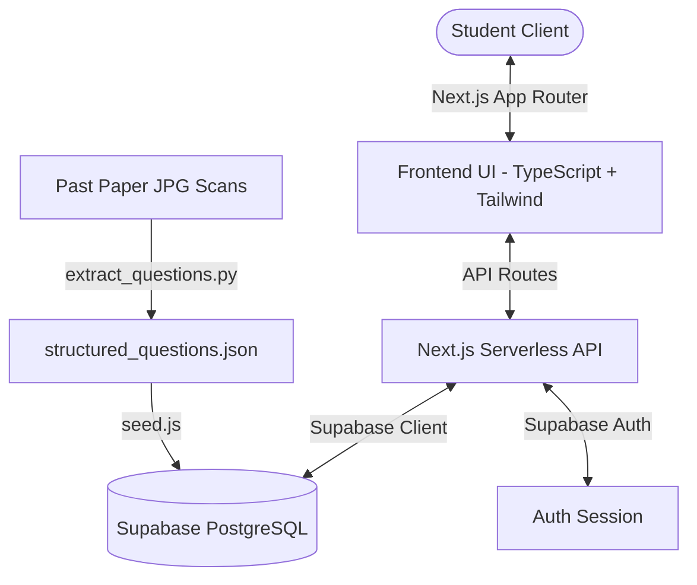

# 🧠 AI-Agent Technical Dossier & Project Context

Welcome, AI Developer! This document is designed to get you up to speed immediately on the architecture, business logic, databases, pipelines, and design principles of the **Comprehensive Exam Prep Platform (Grades 9-12 & University)**.

---

## 🇵🇰 1. The Educational Domain (Pakistan BSEK)

Board exams in Pakistan represent a high-stakes turning point for students. The **Board of Secondary Education Karachi (BSEK)** governs the 9th and 10th-grade curricula in Karachi, which are split into two major streams:
- **Science Group** (Core subjects: Mathematics, Physics, Chemistry, Biology / Computer Science, English, Sindhi, Islamiat)
- **General / Arts Group**

This platform focuses initially on **9th Grade Mathematics** for the Science Group, but will scale to include **Grades 10, 11, 12, and further university-level prep** across other subjects as well.

### BSEK Exam Architecture (Mathematics)
The exam paper consists of **75 Total Marks**, administered over **3 Hours**, and is rigidly structured into three sections:
- **Section A: Multiple Choice Questions (MCQs)** (15 Marks)
  - 15 compulsory questions, each carrying 1 mark.
  - Printed on a separate sheet, collected after 20–30 minutes.
- **Section B: Short Answer Questions** (30 Marks)
  - Students must answer any **6 out of 9–10 questions**.
  - Each question carries **5 marks**.
  - Questions are numbered starting from **Q2** to **Q11**.
- **Section C: Detailed / Descriptive Questions** (30 Marks)
  - Students must answer any **3 out of 4–5 questions**.
  - Each question carries **10 marks** (often divided into sub-parts, e.g., part (a) and (b)).
  - Questions are numbered from **Q12** to **Q16**.

> [!NOTE]
> The optionality in Sections B and C means students can strategically choose which questions to answer. High-priority topic coverage is the best way to guarantee a student can maximize their choices!

---

## 🏗️ 2. Tech Stack & Architectural Map



### Tech Stack Details
- **Frontend**: Next.js 16 (App Router), TypeScript, React 19, Tailwind CSS (v4).
- **Backend**: Next.js Serverless API Routes (utilizing `@supabase/ssr` for authenticated database connections).
- **Database**: Supabase PostgreSQL. Features Row Level Security (RLS) to ensure multi-tenant user isolation.
- **OCR pipeline**: Python 3 (OpenCV for image preprocessing, PyTesseract for OCR engine, NumPy for matrix transformations).

---

## 📊 3. Database Schema Blueprint

The database is built on PostgreSQL inside Supabase. It uses custom ENUMs and constraints to maintain data integrity.

```mermaid
erDiagram
    topics {
        uuid id PK
        text name UNIQUE
        integer frequency "0-10"
        integer marks_weight "0-100"
        priority_level priority "high/medium/low"
        timestamptz created_at
    }
    exams {
        uuid id PK
        integer year UNIQUE
        text subject "Mathematics"
        text board "BSEK"
        integer grade "9"
        text group "Science"
        integer total_marks "75"
        integer time_hours "3"
        jsonb source_files
        jsonb pages_found
    }
    questions {
        uuid id PK
        uuid exam_id FK
        uuid topic_id FK
        section_label section "A/B/C"
        question_type type "mcq/short/detailed"
        text question_number "e.g. 'i', '2', '12'"
        text question_text
        integer marks "1, 5, or 10"
        boolean has_alternative
        text alternative_text
    }
    mcq_options {
        uuid id PK
        uuid question_id FK
        text option_text
        boolean is_correct
        integer display_order
    }
    attempts {
        uuid id PK
        uuid user_id FK "auth.users"
        uuid question_id FK
        boolean is_correct
        timestamptz created_at
    }
    topic_progress {
        uuid id PK
        uuid user_id FK "auth.users"
        uuid topic_id FK
        numeric accuracy "0-100"
        timestamptz last_practiced
        timestamptz updated_at
    }

    exams ||--o{ questions : contains
    topics ||--o{ questions : categorizes
    questions ||--o{ mcq_options : lists
    questions ||--o{ attempts : records
    topics ||--o{ topic_progress : tracks
```

### Critical RLS Policies
Row Level Security is enabled.
1. **Content Tables (`topics`, `exams`, `questions`, `mcq_options`)**: Publicly readable. Anyone (anonymous or authenticated) can query them.
2. **User Data Tables (`attempts`, `topic_progress`)**:
   - `auth.uid() = user_id` constraint is enforced on all operations (SELECT, INSERT, UPDATE, DELETE).
   - Non-authenticated requests are blocked.

---

## ⚙️ 4. The Past-Paper Ingestion Pipeline (OCR)

The pipeline converts physical past paper scans to clean SQL records. The logic resides in `extract_questions.py`.

### The Preprocessing Engine
To overcome poor print quality and scan noise:
1. **Scaling**: Image is resized to a width of at least `1400px` to optimize letter height for Tesseract.
2. **Denoising**: `cv2.fastNlMeansDenoising` reduces scanning dots.
3. **Thresholding**: `cv2.adaptiveThreshold` (using Gaussian C) separates text from the yellowed paper background.

### Text Normalisation & Cleaning
Tesseract often injects mid-word spaces (e.g. `LO G AR IT HMS` or `SECT ION "B"`). The normalisation function collapses single character sequences and maps common OCR mistakes:
- Rejoins scattered letters: `(?<!\w)([a-z] ){3,}[a-z](?!\w)`
- Maps Yen symbol (`¥`), closing quotes (`"`), or `V¥` back to checkmarks (`✓` / `√`), which indicates the correct answer in the digitized key sheet.

### Option Detection Formats
The parser supports two formats common in BSEK printouts:
- **Star-Prefix format (2024)**: Options are separated by asterisks: `* option 1 * option 2 ✓ * option 3`
- **Bracketted letter format (2025)**: Options are separated by letter tags: `(A) option 1 (B) option 2 ✓ (C) option 3`

### Topic Classification
Topic classification is automated using regex keywords mapping to syllabus chapters:
```python
TOPIC_PATTERNS = [
    ("Logarithms",          [r"log", r"logarithm", r"characteristic", r"mantissa", r"antilog"]),
    ("Complex Numbers",     [r"conjugate", r"complex", r"z_?1|z_?2", r"\bi\b.*real", r"argand"]),
    ("Algebra",             [r"factori[sz]e", r"simultaneous", r"quadratic\s*formula", r"complete\s+square"]),
    # ... (see full list in extract_questions.py)
]
```

---

## 🧮 5. API Logic & The Recommendation Formula

The core value proposition is telling the student **exactly what to study first**. This is calculated in `/api/recommendations/route.ts`.

### Mathematical Suggestion Formula
For each topic, we compute a recommendation score:

$$\text{Score} = \text{BaseScore} \times (1 + \text{WeaknessBoost})$$

Where:
- $\text{BaseScore} = \text{PriorityWeight}(\text{topic}) \times \text{Frequency}(\text{topic})$
  - $\text{PriorityWeight}$: `high` = 3, `medium` = 2, `low` = 1
  - $\text{Frequency}$: $0 \dots 10$ (how often the topic appears in past papers)
- $\text{WeaknessBoost}$ represents user performance:
  - If the student has practiced this topic:
    $$\text{WeaknessBoost} = \frac{100 - \text{Accuracy}}{100}$$
  - If the student has **never** practiced this topic (cold start):
    $$\text{WeaknessBoost} = 0.5$$

#### Why this works:
1. High-frequency, high-marks topics always start with a strong base score.
2. If a student practices and gets $100\%$ accuracy, their $\text{WeaknessBoost}$ drops to $0$, dropping the recommendation score.
3. If they perform poorly ($20\%$ accuracy), the boost climbs to $0.8$, raising the priority of that topic.
4. Cold-start topics get a moderate $0.5$ boost to encourage exploration.

---

## 🎨 6. Design System & Frontend Blueprint

When building pages in the `app` folder, you must implement a **visually premium, modern, responsive design**. Do not create boring, gray, minimalist interfaces. The goal is to wow the student at first glance!

### Design Style Tokens
- **Typography**: Import **Outfit** or **Inter** from Google Fonts. Do not use browser default sans-serif.
- **Color Palette**: Use vibrant, balanced gradients instead of plain colors:
  - **Brand / Accent**: Deep Royal Indigo to Electric Violet gradients.
  - **High Priority**: Rose Gold to Bright Coral gradients.
  - **Medium Priority**: Amber Gold to Warm Orange.
  - **Low Priority**: Emerald Mint to Teal.
  - **Backgrounds**: Deep, cohesive dark modes (e.g. Slate 950 or Zinc 900) or ultra-clean glassmorphic light modes (with `backdrop-blur` overlays).
- **Micro-Animations**: Add springy hover transitions on cards (`hover:scale-[1.02] transition-transform duration-300`), interactive rings for progress, and soft fading animations for quiz selections.

---

## 🛠️ 7. The Roadmap: Your Implementation Priorities

The core endpoints are implemented, but the frontend pages are currently bare templates. Follow this checklist to complete the application:

### 1. User Authentication Flow
- Integrate Supabase authentication in the header/dashboard.
- Create beautiful forms for Login/Register.
- Protect `/dashboard` and `/practice` using Next.js middleware or conditional redirects.

### 2. The Student Dashboard (`/dashboard`)
- **Exam Countdown**: A ticking countdown showing time remaining until BSEK board exams (typically held in early May).
- **Personalized Suggestion Cards**: Display the top 3 recommended topics fetched from `/api/recommendations` with high-impact call-to-actions ("Master this next!").
- **Activity Metrics**: Display total questions attempted, overall accuracy, and weekly progress charts using SVG or canvas graphs.

### 3. Topics Hub (`/topics`)
- List all topics fetched from `/api/topics`.
- Sort by priority (high $\rightarrow$ medium $\rightarrow$ low).
- Visual indicators for:
  - Priority level (vibrant badges).
  - Past Paper frequency (scale bars).
  - Student accuracy (SVG progress rings).

### 4. The Practice Engine (`/practice/[topicId]`)
- Fetch 5 random/unattempted questions for the selected topic from the database.
- For **MCQs**:
  - Render an elegant card layout with A, B, C, D choices.
  - Give **immediate interactive feedback** (turns green if correct, red if incorrect, reveals correct answer).
  - Play subtle animations or sounds on completion.
- For **Short / Detailed Answers**:
  - Since written questions cannot be auto-graded, show the question, allow the user to type/outline their solution, and provide a "Reveal Rubric / Ideal Answer" button. The student then self-grades ("I got it right" or "Needs improvement") to log the attempt.
- **Save Attempts**: Make a POST request to `/api/attempt` immediately upon answering each question to persist attempts and update topic accuracies in real time.

---

## 🤝 8. AI Agent Code of Conduct

When writing code in this repository:
1. **Type Safety**: Strictly define types for all backend responses and API payloads using the interfaces in `types/index.ts`. Do not use `any`!
2. **Component Separation**: Keep interactive components client-side (`"use client"`) and content fetching server-side where possible.
3. **No Placeholders**: Never write placeholder components or stub methods. Fully implement logic and design systems.
4. **Database Safety**: Never write raw INSERT or SELECT calls that bypass Row Level Security. Ensure you pass headers or cookies appropriately for the Supabase server client.
5. **Aesthetic Consistency**: When adding components, use Tailwind classes that align with the gradient and typography scheme described above. Let's make an app that students love to use!
